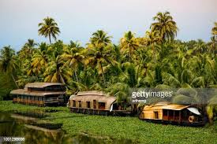
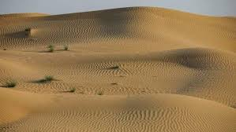
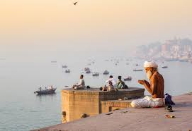
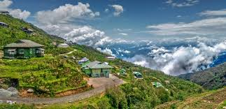

# SAIKIRAN REDDY GANGIDI
 

###### BIRIYANI


I love Biryani, the famous layered, **fragrant rice and meat dish** that takes hours and hours to prepare. It is one of **my favourite thing that my mother cook the best**. Every Indian household has their own complex way of preparing it, and their individual secret ingredients. According to my family lore, it is the water of a particular city that gives each Biryani its distinct flavor. You’ll find different versions in various parts of India--and at restaurants in the US as well. 

---
<br>

### CONTAINERZING THE APPLICATION


1. To containerize a application we need to create a docker file.
2. To Create docker file follow the below line accordingly
    1. Choose a base Image like alpine we use most
    2. Install the necessary packages Using command RUN apt-get .
    3. Add your custom files which need to be preinstall things are present using COPY command
    4. use RUN command to install all the packages with using specified command for example npm install.
    5. Now copy all the other files for in the application.
    6. Then Define the exposed ports using EXPORT command
    7. Use CMD comand run the application
3. Now after creating the docker file We need build it by using command docker build .
4. Then after building the we need to run the container by using command docker run.


<br>
<br>


* The necessary software to run docker files are given below
    * Docker Desktop 
    * vscode


[Here is the my information that is link to AboutMe](AboutMe.md)


----
<br>

## Recommendation of places to visit
<br>
<br>

### 1. kerala

This tropical state in southern India is growing in popularity, though we still find it hard to understand why it hasn’t always topped travelers’ bucket lists. The best of the region lies in two distinct landscapes, one being the scenic tea and spice plantations of Munnar (also loved for its camping, trekking, and wildlife spotting). The **Tata Tea Museum** is a must for tea-lovers looking for more on tea history and production. Kerala’s other (and arguably more famous) region is its **backwaters**, a network of lagoons linked by canals fringed with palm trees, stilted villages, and rice paddies. The easiest way to take it all in is by houseboat, which meander their way downriver and make for a seriously relaxing sojourn.
<br><br>
| LOCATION  |  NUMBER OF HOURS TO SPEND |  EXCEPTED MONEY TO PAY  |
| ---|:---:|---|
|kerala|72| 675 dollars per day|



<br><br>

### 2.Thar Desert


The 77,000 square miles that make up India’s sprawling Thar Desert, known also as the Great Indian Desert, draw a nigh-impenetrable line between India and Pakistan, but you only have to venture so far as Jodhpur or Jaisalmer to catch a glimpse of its shifting dunes and desert culture. Time your visit with the **Desert Festival** to see Thar women in traditional garb making the journey with their great pots of water, the unique—and deeply traditional—competitions involving turban tying and camel dress-up, and folk music and dance performances.
<br><br>

| LOCATION  |  NUMBER OF HOURS TO SPEND |  EXCEPTED MONEY TO PAY  |
| ---|:---:|---|
|Thar Desert|48| 300 dollars per day|


<br><br>

### 3. The ganges

Extensive pollution has muddled the waters and reputation of the mighty river Ganges, but nevertheless, it remains a holy lifeline of Hinduism in India. Two of the country’s oldest and holiest cities—**Varanasi** and **Haridwarare** built along the river’s banks, where Hindus worldwide make the pilgrimage in order to submerge themselves and wash away their sins. Not far from Haridwar, but still along the river, is Rishikesh—the self-prescribed yoga capital of the world.

<br><br>

| LOCATION  |  NUMBER OF HOURS TO SPEND |  EXCEPTED MONEY TO PAY  |
| ---|:---:|---|
| The ganges|24|200 dollars per day|


<br><br>

### 4.Yumthang Valley, Sikkim

As far as natural beauty is concerned, it doesn’t get much better than Yumthang Valley in North Sikkim’s high Himalayan mountains, known as the **“Valley of Flowers.”** Every July to September, trekkers are allowed into the valley, whose sloping meadows are temporarily set ablaze with the colors of several hundred species of orchids, rhododendrons, and native wildflowers. On your hike, keep your eyes peeled for blue sheep and musk deer.

<br><br>

| LOCATION  |  NUMBER OF HOURS TO SPEND |  EXCEPTED MONEY TO PAY  |
| ---|:---:|---|
|Yumthang Valley, Sikkim| 12| 250 dollars per day |


<br><br>


----

## Favourite Quotes

>"Even if we don't have the power to choose where we come from, we can still choose where we go from there."
*-Stephen Chbosky*


>"We are cups, constantly and quietly being filled. The trick is knowing how to tip ourselves over and let the beautiful stuff out." 
*-Ray Bradbury*
    
----

# Go

>Go is a statically typed, compiled programming language designed at Google by Robert Griesemer, Rob Pike, and Ken Thompson. Go is syntactically similar to C, but with memory safety, garbage collection, structural typing, and CSP-style concurrency. The language is often referred to as Golang because of its domain name, golang.org, but the proper name is Go.

Quick link <https://en.wikipedia.org/wiki/Go_(programming_language)>


```
package main


import "fmt"
func main() {
    fmt.Println("hello world")
}

```
quick-link for the code source. <https://gobyexample.com/hello-world>